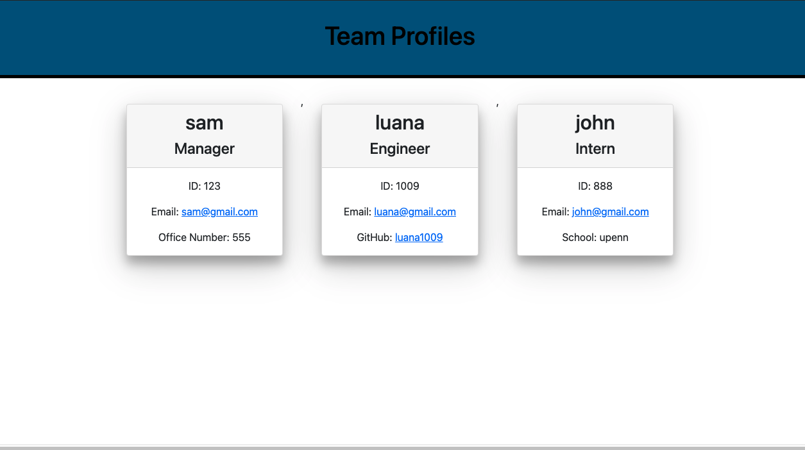
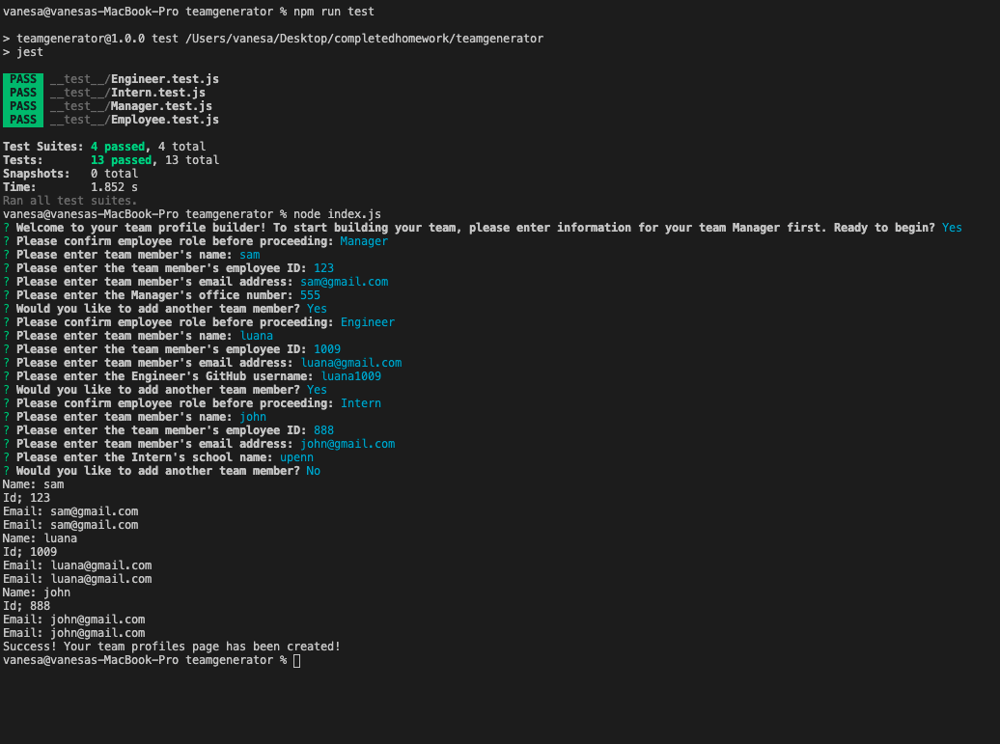

# teamgenerator
Node.js Command-line app

# USER STORY
This app is for the mana get to who whants to generate a webpage that dsiplays 
the team basic info so that the manager has quick and easy access  to their email and GitHub profiles
this is done for the Manager, Engineer and Intern 

along with the node command line date input it will create a a HTM generated app file

# SCREEN SHOT
Here are some screen shots on diffrent steps of the app and video walk through (no audio)

video 

you can also view it HERE 

# CONTACT INFORMATION 
 If you have questions or concernes please contact me via email at gvane1919@gmail.com